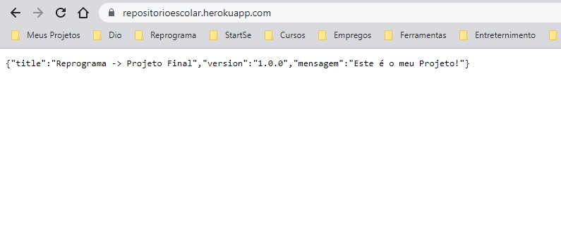

# Projeto Final da Reprograma

## 📌 Repositório para Alunos

## 📷 Banner
  

    
  

___
## ✒️ Descrição

> #### Iniciei na Reprograma meio perdida e desorientada, entendia as aulas enquanto participava delas e nos outros dias percebia que não assimilava nada. Como tenho uma certa dificuldade em aprender, tive a idéia de reassistir as aulas e documentá-las. 
> #### Ótima idéia! 

> #### Documentei tirando prints do passo a passo e... confesso que, depois disso consegui assimilar muita coisa. E... como tenho filhos que estão na fase escolar, percebi que muitas vezes, se eles também documentassem as aulas de alguma forma... seja gravando aquela explicação massa ou tirando fotos da lousa com a explicação mas... e depois?? 

> #### Passar para o caderno que... depois será guardado e esquecido? Se nós Dev's temos onde armazenar nossos projetos que... são importantes pra nós e qualquer um pode acessar, porque os alunos não poderiam ter onde armazenar conteúdos escolares? Creio que os ajudaria futuramente e, talvez ajudasse eles a se interessar mais pelo aprendizado que é tão importante pra vida deles. Então é isso! 

> #### Uma API onde os alunos podem armazenar conteúdos escolares, compartilhar uns com os outros e até mesmo futuramente os professores terem acesso a esses conteúdos e ajudar a melhorar o raciocínio deles.

___
## 🔨 Demonstração das Funcionalidades 🛠️

- `1` [**Rota Principal**](Demonstracao1.md)
- `2` [**C - Post**](Demonstracao2.md)
- `3` [**R - Get**](Demonstracao3.md)
- `4` [**U - Update**](Demonstracao4.md)
- `5` [**D - Delete**](Demonstracao5.md)

